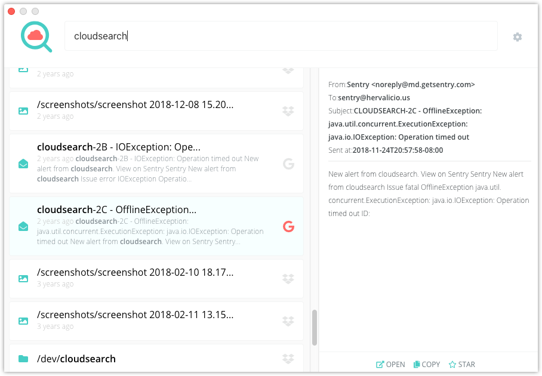

# CloudSearch

A realtime search tool for cloud accounts, with desktop clients for Mac & Windows.

`cloudsearch` allows you to index and search content on cloud services such as Google services
(Gmail, Google Drive, etc) and Dropbox, directly from a command line.

Data gets indexed and stored _on your device only_ - this doesn't utilize any intermediate service
for indexing, nor sends your documents or metadata _anywhere_. The only "intermediary" is an [auth gateway](http://github.com/herval/authgateway),
used for Oauth2 token exchanges, but you can always deploy your own auth, for extra independence. It doesn't log or store any tokens.
